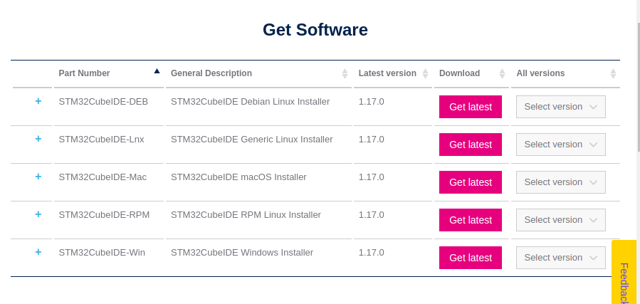
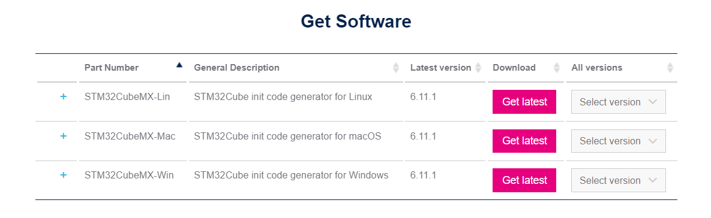
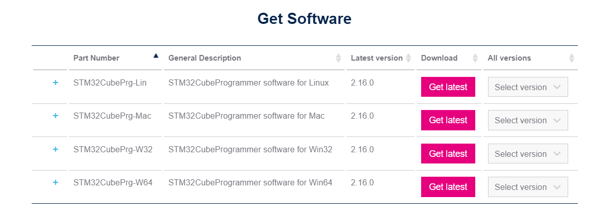
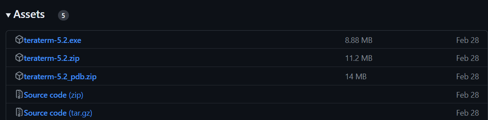
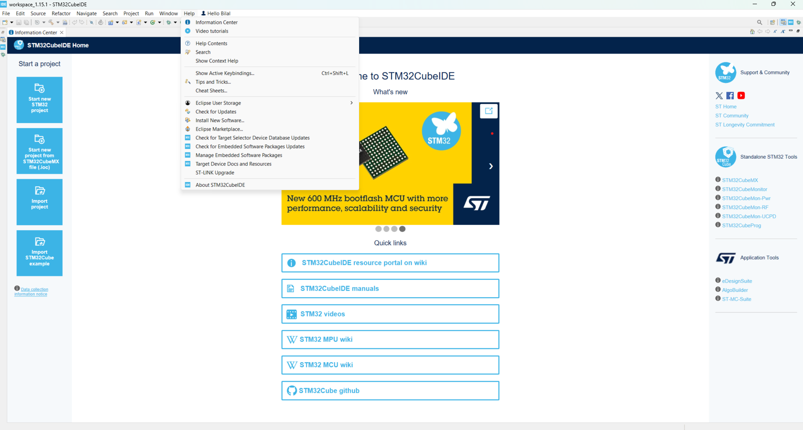
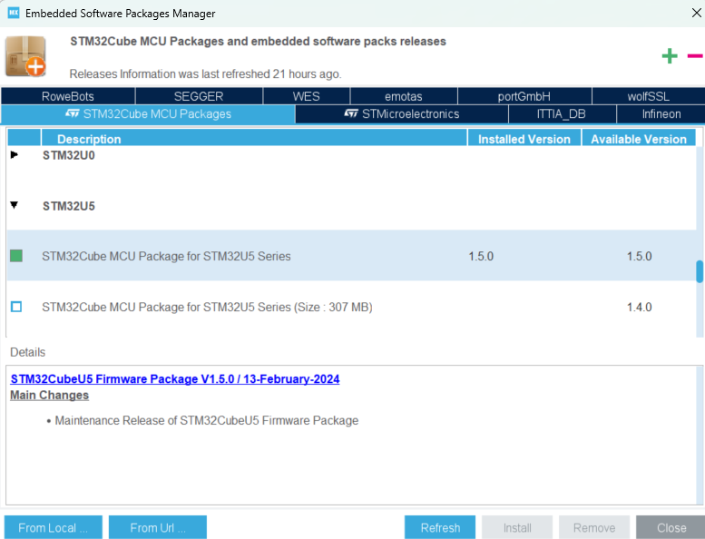
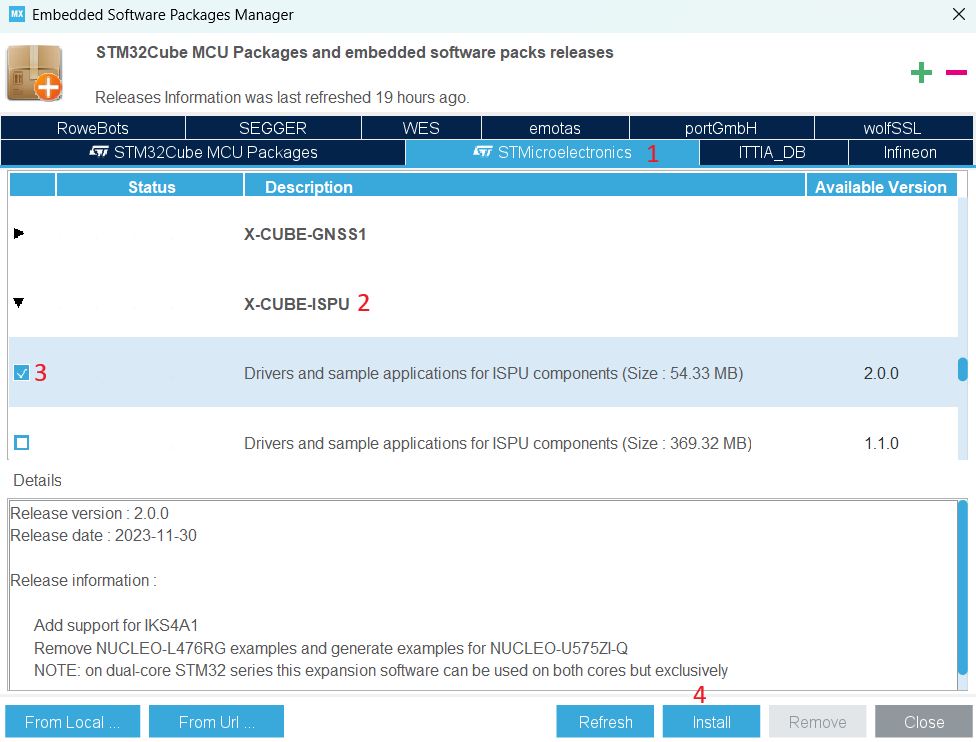
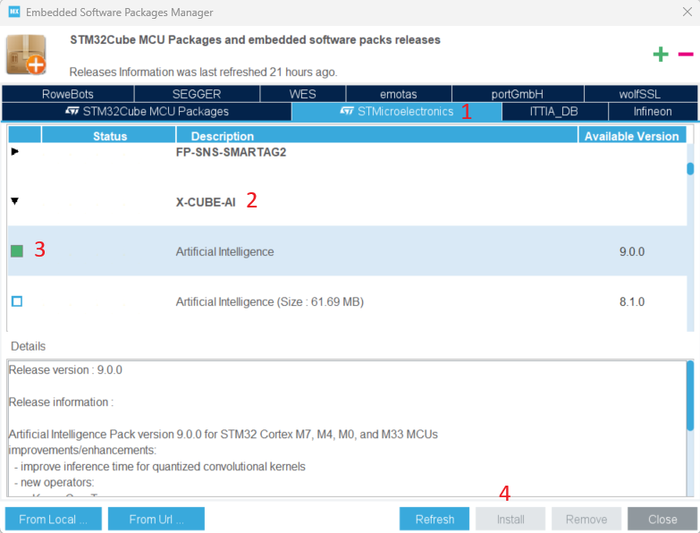

# STM32 Software Installation Manual
This documentation explains the installations of the necessary programs and packages required before the event. The required programs and packages are as follows:

1. [STM32CubeIDE](https://www.st.com/en/development-tools/stm32cubeide.html)
2. [STM32CubeMX](https://www.st.com/en/development-tools/stm32cubemx.html)
3. [STM32CubeProgrammer](https://www.st.com/en/development-tools/stm32cubeprog.html)
4. [TeraTerm](https://github.com/TeraTermProject/teraterm/releases)
5. Software Packages (SW Packages)

## 1- Installing STM32CubeIDE

STM32CubeIDE is an Eclipse-based C/C++ development platform that allows for peripheral configuration, code generation and compilation, debugging, and programming of STM32 microcontrollers and microprocessors.

First, download the latest version of STM32CubeIDE 1.17.0 from the STMicroelectronics website.  
Choose the appropriate version for your operating system from the options below and complete the installation.  
 

  

 

NOTE 1: Ensure that there are no Turkish characters or spaces in the target folder path for the installation.  

NOTE 2: During the installation, you will be asked whether to install the ST-LINK and SEGGER J-Link drivers. Select these drivers and proceed with the installation.

## 2- Installing STM32CubeMX

STM32CubeMX is a graphical tool for easily configuring STM32 microcontrollers and microprocessors, setting clock configurations, and generating initialization code. This tool facilitates step-by-step configuration and generates the necessary startup C code for STM32 devices.

First, download version **STM32CubeMX 6.13.0** from the [STMicroelectronics website](https://www.st.com/en/development-tools/stm32cubemx.html).  
Select the version suitable for your operating system from the options below and complete the installation.  
 

  

 

## 3- Installing STM32CubeProgrammer

STM32CubeProgrammer is a graphical tool designed for programming and configuring STM32 microcontrollers.  
 
First, download the latest version of **STM32CubePrg 2.18.0** from the [STMicroelectronics website](https://www.st.com/en/development-tools/stm32cubeprog.html).  
 

  

 

## 4- Installing Tera Term
Tera Term is a program that enables serial port communication, allowing users to access remote computers and interact with devices using various communication protocols, such as UART. It will be used to establish UART communication between the computer and the development board.  
Download the file from the [GitHub page](https://github.com/TeraTermProject/teraterm/releases) under Assets and complete the installation.  
 

  

 

## 5- Installing Software Packages (SW Packages)

Since a microcontroller from the STM32U5 family will be used in the applications, U5 packages need to be downloaded.  
 
First, launch the STM32CubeIDE program.  

In the opened STM32CubeIDE application, click on **Manage Embedded Software Packages** under the **Help** tab.  

  

 

Under the **STM32Cube MCU Packages** tab, check the box for **STM32U5->STM32Cube MCU Package for STM32U5 Series** version **1.7.0** (download the latest version) and click **install** to complete the installation.  
 

  

 

# 5-A) Installing the X-CUBE-ISPU Software Package 
To install the X-CUBE-ISPU software package, click on **Manage Embedded Software Packages** under the **Help** tab in the STM32CubeIDE application.  
 

  

 

In the opened window, select **STMicroelectronics (1)** from the tabs above. Then, select the **X-CUBE-ISPU (2)** package and check the box for version **2.1.0** (download the latest version). Click **install (4)** to start the download. You must be logged in during the installation process. The installation of the package is now complete.  
 

  

 

# 5-B) Installing the X-CUBE-AI Software Package 
To install the X-CUBE-AI software package, click on **Manage Embedded Software Packages** under the **Help** tab in the STM32CubeIDE application.  
 

  

 

In the opened window, select **STMicroelectronics (1)** from the tabs above. Then, select the **X-CUBE-AI (2)** package and check the box for version **10.0.0** (download the latest version). Click **install (4)** to start the download. You must be logged in during the installation process. The installation of the package is now complete.  
 

  

 

All necessary installations are complete.
