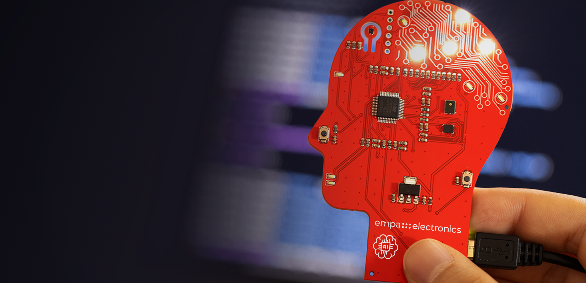
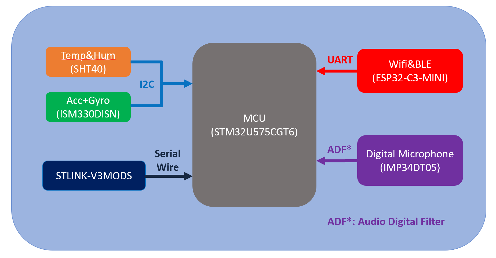

<div align="center">
  
</div>
<div align="center">
  
</div>

# Getting Started Guide for MindBoard
## Introduction
Welcome to the **MindBoard Getting Started!** This guide will help you set up and start using your board for development and testing. Whether you’re a beginner or an experienced user, follow these steps to get your board operational.

This board is designed to facilitate easy development of Edge AI applications on STM32 boards by integrating multiple sensors into a compact design.

## Table of Contents
1. [Package Contents](#package-contents)
2. [Prerequisites](#Prerequisites)
3. [Board Overview](#board-overview)
4. [Hardware Setup](#hardware-setup)
5. [Software Installation](#software-installation)
6. [First Project](#board-overview)
7. [Troubleshooting](#Troubleshooting)
8. [Additional Resources](#additional-resources)

## Package Contents
In the box you will find three main items as shown in <<figure-1>>.

* MindBoard Development Board
* USB Cable
* Stand For MindBoard
* Instruction card with link to the support Getting Started address.

If any items are missing, contact Empa Electronics.

## Prerequisites
Before starting, ensure you have the following:
* A computer running windows 10 or higher
* STM32CUBEIDE and Software Package installed
* Internet connection

if you don't have required softwares you can follow this guide  [STM32 Software Installation Manual](Additionals/ExtraDocs/STM32SoftwareInstallationManual.md)
## Board Overview
### Key Features
* **Processors**: STM32U575 an Arm® Cortex®-M33 processor core running at 160 MHz with TrustZone® for Armv8-M
* **Memory**: 
    * **Flash Memory Size**: 1M (bytes)
    * **RAM size**: 786 K (bytes)
* **Interfaces**: UART, I2C, I2S
* **Special Features**:
    * Integrated sensors for Edge AI applications
        * ST ISM330ISN Accelerometer and Gyroscope Sensor
        * Senserion SHT40 Temperature and Humidity Sensor
        * ST IMP34DT05 Microphone
    * Integrated Wifi Module for IoT Application
        * Espressif ESP32-C3-MINI Module
### Ports and Connectors
Refer to the diagram below to locate key components:

<div align="center">
  
</div>

## Hardware Setup
1. **Connect Power:**
* Use the provided USB cable to connect the board to your computer.
2. **Insert to the Stand:**
* Place the MindBoard to the given stand.
## Software Installation
1. **Download Software:**
* Visit [STM32 Software Installation Manual](Additionals/ExtraDocs/STM32SoftwareInstallationManual.md) to download the required tools and firmware.

2. **Install Drivers:**
* Follow the instructions to install drivers for [Operating System].
3. **Set Up Development Environment:**
* Install STM32Cube IDE.
* Clone the example repository:

```shell
git clone https://github.com/Empa-Teknoloji/Getting-Started-MindBoard.git
```
## First Project
You have two options to get started with your first project:
### Option 1: Using the Template Project
1. **Download the Template Project:**
  * Visit the repository link and download the pre-configured project files.
  * You can find the template under the **project** folder.
2. **Import the Project:**
  * Open STM32CubeIDE.
  * Click ```File``` > ```Import``` > ```Existing Projects into Workspace```.
  * Browse to the downloaded project folder and click ```Finish```.
3. **Build and Run:**
  * Build the project by clicking the hammer icon.
  * Connect the MindBoard and upload the code by clicking the run button.
3. **Verify Output:**
  * Open a serial monitor to observe the output or interact with the example.

### Option 2: Starting with the .ioc File
1. **Download the .ioc File:**
  * Visit the repository link and download the ```.ioc``` file.
  * You can find the ```.ioc``` file under the project folder.
2. **Create a New Project:**
  * Open STM32CubeMX.
  * Load the  ```.ioc ``` file.
3. **Generate Code:**
  * Configure any additional settings as needed.
  * Generate code and open it in STM32CubeIDE.
4. **Write and Upload Code:**
  * Add your application code.
  * Compile and upload as described in the template project steps.

## Troubleshooting
### Common Issues
* **Board Not Detected:**
    * Ensure the USB cable is connected securely.
    * Check drivers are installed properly.
* **Program Fails to Upload:**
    * Verify board settings in the IDE.
    * Ensure correct COM port is selected.
* **No Output on Terminal:**
    * Check the baud rate and connection settings.

For further assistance, please fill this form [Bug and Feature Form](https://forms.clickup.com/9005076790/f/8cbx49p-9232/OOHL4GCE7PVTWTPWMJ)

## Revisions
Update dates can be check from table below:
```
Version-0.3: 09 Jan 2025
* Project template and IOC file have been added.
* Support Form Created.
* README file has been updated.
Version-0.2: 07 Jan 2025
* Images and Port information have been added.
Version-0.1: 06 Jan 2025
* First initial Setup Github Repo has been Created.
```
<div align="center">
  
</div>